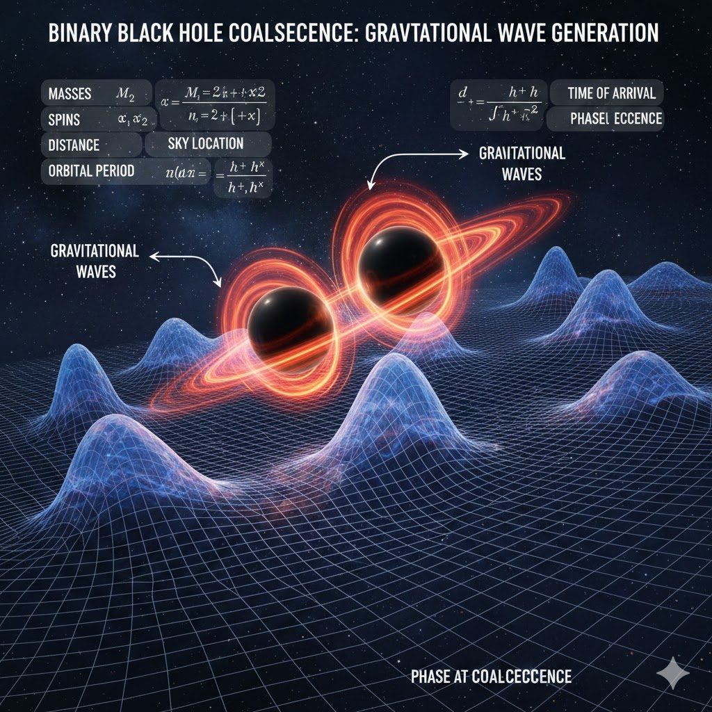

# Filter Principles and Applications in Gravitational Wave Signal Processing



*Figure: Illustration of gravitational wave generation from binary black hole coalescence. As two black holes orbit each other, they radiate gravitational waves, creating ripples in spacetime.*

## 1. Introduction

Gravitational waves are ripples in spacetime produced by the accelerated motion of massive celestial bodies, such as the merger of binary black holes or binary neutron stars. In 2015, LIGO (Laser Interferometer Gravitational-Wave Observatory) made the first direct detection of gravitational wave signals, opening a new era of gravitational wave astronomy. However, gravitational wave signals are extremely weak, and the data received by detectors is filled with various types of noise, including seismic noise, thermal noise, and quantum noise. Therefore, signal processing techniques, especially the application of filters, play a crucial role in gravitational wave data analysis.

This article introduces four types of filters commonly used in gravitational wave signal processing: Bandpass Filter, Highpass Filter, Lowpass Filter, and Narrow Band Filter, analyzing their working principles, mathematical foundations, and specific applications in gravitational wave detection.

---

## 2. Basic Principles of Filters

### 2.1 What is a Filter

A filter is a signal processing system that can selectively pass or suppress different frequency components in a signal. From a mathematical perspective, a filter is a linear time-invariant system whose action can be described by convolution or frequency domain multiplication.

In the frequency domain, any signal can be decomposed into a superposition of sine waves of different frequencies (Fourier Transform). Filters determine which frequency components are retained and which are attenuated by setting different frequency response functions.

**Relationship Between Time Domain and Frequency Domain**:
- Time domain: representation of signal variation over time, $x(t)$
- Frequency domain: representation of signal frequency components, $X(f) = \mathcal{F}\{x(t)\}$
- Filtering operation: $Y(f) = H(f) \cdot X(f)$, where $H(f)$ is the filter's frequency response

### 2.2 Butterworth Filter

This project uses the Butterworth filter, one of the most commonly used IIR (Infinite Impulse Response) filters. The Butterworth filter is characterized by having a **maximally flat magnitude response** in the passband, meaning no ripple in the passband and a very smooth frequency response curve.

**Butterworth Filter Magnitude Response Function**:

$$|H(j\omega)|^2 = \frac{1}{1 + (\omega/\omega_c)^{2N}}$$

Where:
- $\omega_c$ is the cutoff frequency (-3dB point)
- $N$ is the filter order
- Higher order means steeper transition band

**Why Choose Butterworth**:
1. Maximally flat in passband, no additional ripple introduced
2. Relatively linear phase response
3. High computational efficiency
4. SciPy library provides complete implementation

### 2.3 filtfilt Zero-Phase Filtering

The `signal.filtfilt()` function used in the code implements **zero-phase filtering**. It eliminates the phase delay introduced by the filter by filtering the signal twice (once forward, once backward).

**Working Principle**:
1. Forward filtering: $y_1 = h * x$
2. Backward filtering: $y_2 = h * \text{flip}(y_1)$
3. Flip again: $y = \text{flip}(y_2)$

Advantages of this method:
- **Zero phase delay**: signal time position does not shift
- **Squared magnitude response**: equivalent to squaring the filter's magnitude response, steeper transition band
- **Causality**: although filtfilt is non-causal (requires entire signal), it is ideal for offline analysis

This is particularly important for gravitational wave signal analysis, as we need to precisely determine the arrival time of signals, and any phase shift would affect the accuracy of signal localization.

---

## 3. Detailed Introduction to Four Types of Filters

### 3.1 Bandpass Filter (20-500Hz)

**Principle**: A bandpass filter only allows signals within a specific frequency range to pass while suppressing signal components below the lower cutoff and above the upper cutoff frequencies. It is equivalent to a series combination of highpass and lowpass filters.

**Frequency Response Characteristics**:

```
Magnitude
  |
1 |     ___________
  |    /           \
  |   /             \
  |  /               \
0 |_/                 \_______
  +----+----+----+----+-----> Frequency
      20   100  300  500
     Lower        Upper
```

**Mathematical Expression**: The transfer function of a bandpass filter can be expressed as:

$$H(s) = \frac{K \cdot s^N}{(s^2 + \frac{\omega_0}{Q}s + \omega_0^2)^{N/2}}$$

Where:
- $\omega_0$ is the center frequency
- $Q$ is the quality factor, determining the passband width
- $K$ is the gain constant

**Why Choose 20-500Hz**:

| Frequency Range | Noise Source | Processing Method |
|----------------|--------------|-------------------|
| < 20Hz | Seismic noise, temperature drift, suspension system vibration | Highpass filtering |
| 20-500Hz | **Main frequency band of gravitational wave signals** | Retain |
| > 500Hz | Quantum shot noise, electronic noise | Lowpass filtering |

**LIGO Detector Sensitivity Curve**:
- Severely affected by seismic noise below 20Hz
- Reaches optimal sensitivity around 100-300Hz
- High frequency band limited by quantum noise

**Application Effect**: Bandpass filters can effectively extract the main frequency components of gravitational wave signals and remove most environmental noise, making it the most basic and important filtering step in gravitational wave data processing.

---

### 3.2 Highpass Filter (20Hz)

**Principle**: A highpass filter allows signals above the cutoff frequency to pass while suppressing signal components below the cutoff frequency.

**Frequency Response Characteristics**:

```
Magnitude
  |
1 |          _______________
  |         /
  |        /
  |       /
0 |______/
  +----+----+----+----+-----> Frequency
      10   20   50  100
          Cutoff
```

**Mathematical Expression**:

First-order highpass filter transfer function:
$$H(s) = \frac{s}{s + \omega_c}$$

N-order Butterworth highpass filter magnitude response:
$$|H(j\omega)|^2 = \frac{(\omega/\omega_c)^{2N}}{1 + (\omega/\omega_c)^{2N}}$$

**Why Use Highpass Filtering**:

1. **Remove DC component**: detector output may have DC bias
2. **Eliminate seismic noise**: low-frequency noise from Earth's microseisms, traffic vibrations, waves, etc.
3. **Remove suspension system vibration**: LIGO's mirror suspension system produces low-frequency mechanical vibrations
4. **Eliminate temperature drift**: slow drift during long-term measurements

**Difference from Bandpass**:
- Highpass filter does not limit high-frequency components, retaining more high-frequency information
- Suitable for scenarios requiring high-frequency component analysis
- Disadvantage is that high-frequency noise is also retained

---

### 3.3 Lowpass Filter (500Hz)

**Principle**: A lowpass filter allows signals below the cutoff frequency to pass while suppressing signal components above the cutoff frequency.

**Frequency Response Characteristics**:

```
Magnitude
  |
1 |____________
  |            \
  |             \
  |              \
0 |               \__________
  +----+----+----+----+-----> Frequency
     100  300  500  700
              Cutoff
```

**Mathematical Expression**:

N-order Butterworth lowpass filter transfer function:
$$H(s) = \frac{\omega_c^N}{\prod_{k=1}^{N}(s - s_k)}$$

Where $s_k$ are the filter poles, located in the left half of the s-plane.

**Magnitude Response**:
$$|H(j\omega)|^2 = \frac{1}{1 + (\omega/\omega_c)^{2N}}$$

**Why Use Lowpass Filtering**:

1. **Remove high-frequency electronic noise**: high-frequency noise from photodetectors and amplifiers
2. **Eliminate quantum shot noise**: laser quantum fluctuations dominate at high frequencies
3. **Suppress optical system vibrations**: high-frequency vibration modes of mirrors
4. **Smooth signal**: highlight low-frequency trends for easier observation

**Application Scenarios**:
- Analyzing the early inspiral phase of massive black hole mergers (low-frequency signals)
- Anti-aliasing filtering before data downsampling
- Signal envelope extraction

---

### 3.4 Narrow Band Filter (30-200Hz)

**Principle**: A narrow band filter is a bandpass filter with a narrow passband width, allowing only signals within a narrow frequency range to pass.

**Frequency Response Characteristics**:

```
Magnitude
  |
1 |       ____
  |      /    \
  |     /      \
  |    /        \
0 |___/          \___________
  +----+----+----+----+-----> Frequency
      30   100  200  300
      Lower      Upper
```

**Why Choose 30-200Hz**:

1. **Strongest signal region**: chirp signals from stellar-mass binary black hole mergers are strongest in this band
2. **Optimal detector sensitivity**: LIGO has highest sensitivity in the 50-200Hz range
3. **Optimal SNR**: focusing analysis on the core band maximizes signal-to-noise ratio
4. **Chirp signal characteristics**: the last few cycles before merger are mainly concentrated in this band

**Quality Factor Q**:

An important parameter for narrow band filters is the quality factor Q:
$$Q = \frac{f_0}{\Delta f} = \frac{\text{Center Frequency}}{\text{Bandwidth}}$$

| Q Value | Bandwidth Characteristic | Application Scenario |
|---------|------------------------|---------------------|
| < 1 | Wideband | Broadband signal analysis |
| 1-10 | Medium | General bandpass filtering |
| > 10 | Narrowband | Specific frequency extraction |

**Comparison with Wideband Bandpass**:

| Characteristic | Wideband Bandpass (20-500Hz) | Narrowband (30-200Hz) |
|---------------|------------------------------|----------------------|
| Bandwidth | 480Hz | 170Hz |
| SNR | Medium | Higher |
| Information Retention | Complete | May lose edge information |
| Noise Suppression | Moderate | Stronger |

---

## 4. Role of Window Functions

### 4.1 Tukey Window (Cosine-Tapered Window)

The code uses the Tukey window function. The Tukey window is a compromise between the rectangular window and the Hanning window.

**Mathematical Definition**:

$$w(n) = \begin{cases} 
\frac{1}{2}\left[1 + \cos\left(\pi\left(\frac{2n}{\alpha(N-1)} - 1\right)\right)\right] & 0 \leq n < \frac{\alpha(N-1)}{2} \\
1 & \frac{\alpha(N-1)}{2} \leq n \leq (N-1)(1-\frac{\alpha}{2}) \\
\frac{1}{2}\left[1 + \cos\left(\pi\left(\frac{2n}{\alpha(N-1)} - \frac{2}{\alpha} + 1\right)\right)\right] & (N-1)(1-\frac{\alpha}{2}) < n \leq N-1
\end{cases}$$

**Effect of Parameter α**:

| α Value | Window Type | Characteristics |
|---------|-------------|-----------------|
| 0 | Rectangular window | No attenuation, severe spectral leakage |
| 0.1-0.3 | Tukey window | Slight edge attenuation, good balance |
| 1 | Hanning window | Full cosine attenuation, small spectral leakage |

### 4.2 Why Window Functions Are Needed

**Spectral Leakage Problem**:
- When performing Fourier transform on finite-length signals, it's equivalent to truncating the signal with a rectangular window
- Truncation causes sidelobes in the spectrum, affecting the accuracy of frequency analysis

**Functions of Window Functions**:
1. Smooth signal edges, reduce truncation effects
2. Reduce filter edge effects
3. Improve stability of spectral estimation
4. Suppress spectral leakage

---

## 5. Code Implementation Analysis

### 5.1 Filter Configuration

```python
FILTER_CONFIGS = {
    'raw': {
        'name': 'Raw Signal (No Filter)',
        'params': None,
        'color': '#FFFFFF'
    },
    'bandpass': {
        'name': 'Bandpass (20-500Hz)',
        'params': {'N': 4, 'Wn': (20, 500), 'btype': 'bandpass', 'fs': 2048},
        'color': '#00D4FF'
    },
    'highpass': {
        'name': 'Highpass (20Hz)',
        'params': {'N': 4, 'Wn': 20, 'btype': 'highpass', 'fs': 2048},
        'color': '#FF6B6B'
    },
    'lowpass': {
        'name': 'Lowpass (500Hz)',
        'params': {'N': 4, 'Wn': 500, 'btype': 'lowpass', 'fs': 2048},
        'color': '#50FA7B'
    },
    'narrow_band': {
        'name': 'Narrow Band (30-200Hz)',
        'params': {'N': 4, 'Wn': (30, 200), 'btype': 'bandpass', 'fs': 2048},
        'color': '#FFB86C'
    }
}
```

**Parameter Explanation**:
- `N=4`: 4th order Butterworth filter, providing moderate transition band steepness
- `Wn`: cutoff frequency in Hz (because `fs` is specified)
- `btype`: filter type
- `fs=2048`: sampling frequency 2048Hz (typical sampling rate for LIGO data)

### 5.2 Filter Function Implementation

```python
def apply_filter(wave, filter_type='bandpass'):
    """Apply filter while preserving signal characteristics"""
    # Raw signal directly normalized and returned
    if filter_type == 'raw':
        normalized = wave / (np.max(np.abs(wave)) + 1e-8)
        return normalized
    
    # Get filter parameters
    config = FILTER_CONFIGS[filter_type]['params']
    
    # Design Butterworth filter
    b, a = signal.butter(**config)
    
    # Zero-phase filtering
    filtered = signal.filtfilt(b, a, wave)
    
    # Apply mild window function (only attenuate edges)
    window = signal.windows.tukey(len(filtered), alpha=0.1)
    filtered = filtered * window
    
    # Normalize to [-1, 1]
    max_val = np.max(np.abs(filtered))
    if max_val > 1e-10:
        filtered = filtered / max_val
    
    return filtered
```

**Key Step Analysis**:

1. **Filter Design** `signal.butter(**config)`
   - Returns filter numerator coefficients `b` and denominator coefficients `a`
   - These coefficients define the difference equation: $y[n] = \sum b_k x[n-k] - \sum a_k y[n-k]$

2. **Zero-Phase Filtering** `signal.filtfilt(b, a, wave)`
   - Filters forward and backward once each
   - Eliminates phase delay
   - Equivalent filter order doubled (8th order effect)

3. **Window Function Application** `signal.windows.tukey(len(filtered), alpha=0.1)`
   - α=0.1 means only 10% of edges are attenuated
   - 90% of signal remains unaffected
   - Reduces edge effects

4. **Normalization**
   - Normalizes signal amplitude to [-1, 1]
   - Adds 1e-10 to prevent division by zero
   - Facilitates comparison of different filtering results

### 5.3 Spectrogram Generation

```python
def create_spectrogram(wave, transform):
    wave_tensor = torch.from_numpy(wave.astype(np.float32))
    image = transform(wave_tensor)
    image = np.array(image)
    return np.transpose(image, (1, 2, 0))
```

**CQT Transform (Constant-Q Transform)**:

```python
transform = CQT1992v2(sr=2048, hop_length=64, fmin=20, fmax=500)
```

- `sr=2048`: sampling rate
- `hop_length=64`: frame shift, determines time resolution
- `fmin=20, fmax=500`: frequency range
- CQT advantage over STFT: higher low-frequency resolution, more suitable for music and gravitational wave signals

### 5.4 Visualization Function

```python
def plot_waveform(ax, data, color, title, show_envelope=True, alpha=0.9):
    time = np.linspace(0, 2, len(data))
    ax.plot(time, data, color=color, linewidth=0.6, alpha=alpha)
    
    # Draw Hilbert envelope
    if show_envelope and np.std(data) > 0.01:
        analytic = signal.hilbert(data)
        envelope = np.abs(analytic)
        ax.fill_between(time, -envelope, envelope, color=color, alpha=0.1)
    
    # Dynamically set y-axis range
    data_range = np.max(np.abs(data))
    ax.set_ylim(-data_range * 1.3, data_range * 1.3)
```

**Hilbert Transform and Envelope**:
- `signal.hilbert(data)` computes the analytic signal
- The magnitude of the analytic signal is the signal envelope
- Envelope shows instantaneous amplitude variation, particularly useful for chirp signals

---

## 6. Practical Applications in Gravitational Wave Detection

### 6.1 Data Preprocessing Pipeline

Typical gravitational wave data preprocessing pipeline:

```
Raw Data (16384Hz)
      ↓
  [Downsample to 4096Hz or 2048Hz]
      ↓
  [Bandpass Filter 20-500Hz]
      ↓
  [Whitening]
      ↓
  [Apply Window Function]
      ↓
  [Matched Filtering / ML Model]
      ↓
  Signal Detection Result
```

### 6.2 Whitening

Whitening is an important step in gravitational wave data processing that flattens the noise power spectral density:

$$\tilde{x}_{white}(f) = \frac{\tilde{x}(f)}{\sqrt{S_n(f)}}$$

Where $S_n(f)$ is the noise power spectral density.

Functions of whitening:
- Makes noise contributions equal at different frequencies
- Improves effectiveness of matched filtering
- Makes signal have comparable SNR at all frequencies

### 6.3 Matched Filtering

Matched filtering is the optimal method for detecting signals of known shape:

$$\rho(t) = \int_{-\infty}^{\infty} \frac{\tilde{s}(f) \tilde{h}^*(f)}{S_n(f)} e^{2\pi i f t} df$$

Where:
- $\tilde{s}(f)$ is the Fourier transform of the data
- $\tilde{h}(f)$ is the Fourier transform of the template waveform
- $S_n(f)$ is the noise power spectral density

### 6.4 Collaborative Analysis of Three Detectors

```python
detector_names = ['LIGO Hanford', 'LIGO Livingston', 'Virgo']
detector_indices = [1, 2, 0]  # Index order in data
```

**Why Multiple Detectors Are Needed**:
1. **Confirm signal authenticity**: multiple detectors observe similar signals simultaneously
2. **Signal localization**: use arrival time differences to determine source direction
3. **Reduce false positive rate**: false signals from single detector unlikely to recur in other detectors
4. **Parameter estimation**: multi-detector data enables more precise signal parameter estimation

---

## 7. Comparison of Different Filter Effects

### 7.1 With GW Signal vs Without GW Signal

| Characteristic | With GW Signal | Without GW Signal |
|---------------|----------------|-------------------|
| Raw signal | May contain chirp hidden in noise | Pure noise |
| After bandpass | Chirp features more evident | Still noise |
| After narrowband | Signal most concentrated | Noise reduced |
| Spectrogram | Visible rising frequency trajectory | No obvious structure |

### 7.2 Filter Selection Guide

| Analysis Goal | Recommended Filter | Reason |
|--------------|-------------------|--------|
| Full-band analysis | Bandpass (20-500Hz) | Balance noise suppression and signal retention |
| Low-frequency signals | Lowpass + Highpass combination | Flexible frequency range adjustment |
| High SNR detection | Narrowband (30-200Hz) | Focus on core frequency band |
| Remove low-frequency noise | Highpass (20Hz) | Eliminate seismic and drift |
| Feature visualization | Multi-filter comparison | Comprehensive understanding of signal characteristics |

---

## 8. Advanced Topics

### 8.1 Adaptive Filtering

For non-stationary noise, adaptive filtering techniques can be used to dynamically adjust filter parameters based on noise characteristics.

### 8.2 Wavelet Transform

Wavelet transform provides time-frequency analysis capability, particularly suitable for analyzing chirp-type signals whose frequency varies with time:

$$W(a, b) = \frac{1}{\sqrt{a}} \int x(t) \psi^*\left(\frac{t-b}{a}\right) dt$$

### 8.3 Machine Learning Methods

Modern gravitational wave detection increasingly uses deep learning:
- CNN for spectrogram classification
- RNN/LSTM for time series signal analysis
- Autoencoders for anomaly detection

These methods can learn more complex features, but traditional filtering remains the foundation of data preprocessing.

---

## 9. Summary

Filters play an indispensable role in gravitational wave signal processing. By properly selecting filter types and parameters, we can effectively extract weak gravitational wave signals from noisy detector data.

**Key Points**:

1. **Bandpass filter** is the most common choice, capable of retaining the main frequency components of signals while removing most noise

2. **Highpass and lowpass filters** can be used independently according to specific analysis needs, providing more flexible frequency control

3. **Narrowband filter** is particularly useful in scenarios requiring high SNR, focusing on the strongest signal frequency band

4. **Zero-phase filtering** (filtfilt) is crucial for maintaining signal time accuracy

5. **Window functions** can reduce edge effects and spectral leakage

6. **Multi-detector collaborative analysis** is key to confirming the authenticity of gravitational wave signals

Understanding the working principles and application scenarios of these filters is crucial for correctly processing and analyzing gravitational wave data. As gravitational wave detection technology continues to develop, more advanced signal processing methods are being widely researched and applied, but traditional filtering techniques remain the foundation and core of data preprocessing.

---

## References

1. LIGO Scientific Collaboration. "LIGO Data Analysis Guide"
2. B. P. Abbott et al. "Observation of Gravitational Waves from a Binary Black Hole Merger" (2016)
3. SciPy Documentation: Signal Processing (scipy.signal)
4. nnAudio: Neural Network Audio Processing Library
5. Butterworth, S. "On the Theory of Filter Amplifiers" (1930)

---

*Document generated: March 2026*
*Code version: visual.py*
