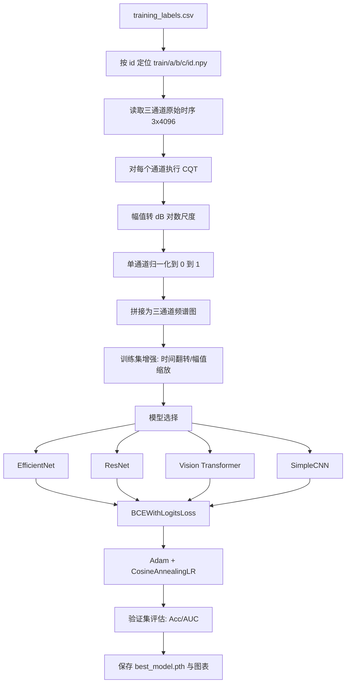

# 引力波检测的数据处理与模型结构设计说明

## 1. 文档目的

本文档面向当前项目中的训练代码实现，系统说明从原始引力波时序数据到二分类结果输出的完整流程，重点覆盖以下内容：

1. 数据读取与样本划分方式
2. CQT 频谱图特征构建过程
3. 训练阶段的数据增强、损失函数与评估指标
4. `EfficientNet`、`ResNet`、`Transformer`、`SimpleCNN` 四类模型的结构设计
5. 实验输出、日志与结果目录组织方式

文中内容严格对应当前代码实现，核心逻辑来自 `train.py` 与 `models/` 目录下的模型文件，同时结合 `README_CN.md` 引言中的研究背景进行补充说明。

---

## 2. 研究背景与任务定义

引力波是由双黑洞、双中子星等大质量天体加速运动产生的时空扰动。2015 年 LIGO 首次直接探测到引力波，标志着引力波天文学进入实证阶段。然而，这类信号极其微弱，埋藏在复杂噪声之中，传统人工特征设计方法难以同时兼顾时域与频域结构。因此，深度学习方法被广泛用于构建端到端的识别系统。

当前项目的训练任务是一个二分类问题：

- 标签 `0`：无引力波事件
- 标签 `1`：存在引力波事件

数据集中每个样本包含三个探测器通道、每个通道 4096 个采样点，因此原始输入可记为：

$$
\mathbf{X} \in \mathbb{R}^{3 \times 4096}
$$

其中 3 对应三个探测器，4096 对应单段时序长度。当前训练代码并未在训练阶段引入 `visual.py` 中的带通、高通或低通滤波流程，而是直接对原始波形做时频变换，随后送入图像型深度模型进行学习。

---

## 3. 总体流程概览

当前训练框架的核心处理链条如下：



从工程上看，该流程的目标非常明确：将超弱的一维多通道时序信号转换为更适合卷积网络或 Transformer 捕捉结构模式的二维时频表示。

---

## 4. 数据组织与样本划分

### 4.1 数据路径组织

代码通过样本 `id` 自动构造文件路径：

$$
\text{path}(id)=\text{train}/id_0/id_1/id_2/id.npy
$$

这与 G2Net 数据集的分层存储规则一致，可减少单目录文件过多带来的管理问题。

标签文件由 `training_labels.csv` 提供，主要字段包括：

- `id`：样本编号
- `target`：二分类标签

### 4.2 数据集划分

训练脚本使用 `train_test_split` 做分层划分：

$$
\mathcal{D} = \mathcal{D}_{train} \cup \mathcal{D}_{val}
$$

其中：

- 验证集比例 `test_size = 0.2`
- 随机种子 `random_seed = 42`
- 按 `target` 做 `stratify`

也就是说，训练集和验证集的正负样本比例会尽量保持一致，这对于二分类任务尤其重要，否则验证指标会因为类别比例偏差而产生误导。

---

## 5. 从时域波形到 CQT 频谱图

### 5.1 为什么不用原始时序直接训练

虽然原始输入是三通道长度 4096 的波形，但引力波信号具有非常典型的时频演化结构，尤其是并合前的 chirp 现象，表现为频率随时间上升。若直接在时域学习，模型不仅要学习局部振荡模式，还要同时自己发现频率随时间变化的规律，训练难度较高。

因此，当前代码选择先将时域信号映射到时频域，再交给视觉模型处理。这使得信号中的轨迹、能量分布和多探测器一致性更容易被模型捕捉。

### 5.2 CQT 的原理

代码中使用 `nnAudio.Spectrogram.CQT1992v2` 构造 Constant-Q Transform。其核心思想是不同频率使用不同长度的分析窗，使得频率分辨率和时间分辨率在对数频率轴上更均衡，适合处理具有多尺度结构的非平稳信号。

可将 CQT 形式写为：

$$
X(k, n) = \sum_{m=0}^{N_k-1} x[n-m] \, a_k^*[m]
$$

其中：

- $k$ 表示频率 bin
- $n$ 表示时间位置
- $a_k[m]$ 表示与第 $k$ 个中心频率对应的分析核
- $N_k$ 会随频率变化

在当前实现中，关键参数为：

- 采样率 `sr = 2048`
- 最低频率 `fmin = 20`
- 最高频率 `fmax = 1024`
- 步长 `hop_length = 32`

### 5.3 三通道处理方式

设三个探测器原始波形分别为：

$$
\mathbf{x}^{(1)}, \mathbf{x}^{(2)}, \mathbf{x}^{(3)} \in \mathbb{R}^{4096}
$$

代码会逐通道执行：

1. 转为 `torch.float`
2. 做 CQT
3. 转换到对数幅度域
4. 归一化
5. 最后按通道堆叠为三通道频谱图

得到最终输入：

$$
\mathbf{I} \in \mathbb{R}^{3 \times H \times W}
$$

在当前代码与调试设置下，Transformer 分支显式假设输入尺寸约为：

$$
H \times W \approx 69 \times 129
$$

### 5.4 为什么要做对数压缩

引力波原始信号数值范围非常小，若直接使用线性幅值，频谱图中的能量分布容易因为动态范围过大而表现为“几乎全黑”或“几乎平坦”。代码中使用：

$$
X_{dB} = 20 \log_{10}(X + 10^{-30})
$$

这样做有两个直接好处：

1. 压缩动态范围，使弱信号结构更容易显现
2. 让不同样本之间的数值尺度更稳定，利于神经网络优化

### 5.5 单样本归一化

对于每个通道的 dB 频谱，代码采用最小最大归一化：

$$
\hat{X} = \frac{X - X_{\min}}{X_{\max} - X_{\min}}
$$

若分母过小，则直接赋值为常数 `0.5`，避免出现数值异常。这个保护逻辑反映了当前代码在调试阶段对“频谱图退化为常数图”的显式防御。

---

## 6. 训练阶段的数据增强

当前数据增强只在训练集启用，验证集保持原始处理结果。增强策略较轻量，目标是增加鲁棒性而不过度破坏物理结构。

### 6.1 时间轴翻转

代码以 0.5 概率沿频谱图宽度方向翻转：

$$
\tilde{I}(c, h, w) = I(c, h, W-1-w)
$$

该操作对应时间轴反转，有助于提升模型对局部模式的适应能力，但也意味着这种增强更偏向工程层面的泛化增强，而非严格物理对称性建模。

### 6.2 幅值缩放

代码以 0.3 概率对整张图乘以随机比例因子：

$$
\tilde{I} = \alpha I,\quad \alpha \sim U(0.9, 1.1)
$$

它模拟不同样本强度的轻微变化，有助于减弱模型对绝对亮度的依赖。

---

## 7. 模型结构设计

当前项目支持四类模型，统一输入均为三通道 CQT 频谱图，统一输出为一个标量 logit。

### 7.1 EfficientNet

EfficientNet 是当前工程中的默认模型，也是最适合作为起点的模型。其优势在于通过复合缩放策略同时平衡网络深度、宽度和分辨率。

设网络映射为：

$$
z = f_{\theta}(\mathbf{I})
$$

其中 $z \in \mathbb{R}$ 为二分类 logit。代码中使用预训练的 `EfficientNet-B0 ~ B7` 作为骨干网络，并替换最终分类头为：

$$
\text{Dropout}(0.3) \rightarrow \text{Linear}(d, 1)
$$

该设计的动机是：

1. 利用 ImageNet 预训练参数获得更稳定的特征抽取能力
2. 保留较强的二维模式建模能力
3. 通过小型分类头适配当前二分类任务

### 7.2 ResNet

ResNet 使用残差连接缓解深层网络训练困难，其基本思想是让网络学习残差函数而不是完整映射：

$$
\mathbf{y} = \mathcal{F}(\mathbf{x}) + \mathbf{x}
$$

其中 $\mathcal{F}(\mathbf{x})$ 由卷积层构成。当前代码支持：

- `resnet18`
- `resnet34`
- `resnet50`
- `resnet101`
- `resnet152`

同样使用预训练权重，并将最终全连接层替换为：

$$
\text{Dropout}(0.3) \rightarrow \text{Linear}(d, 256) \rightarrow \text{ReLU}
\rightarrow \text{Dropout}(0.2) \rightarrow \text{Linear}(256, 1)
$$

相比 EfficientNet，ResNet 更经典、解释性更强，也更适合作为结构对照实验。

### 7.3 Vision Transformer

Transformer 分支是当前项目中模型上限最高、结构最具有研究价值的部分。其基本思路不是依赖卷积局部归纳偏置，而是把频谱图切分为 patch，再利用全局自注意力建模 patch 与 patch 之间的关系。

#### 7.3.1 Patch Embedding

输入图像先被分成不重叠 patch。若 patch 大小为 $P \times P$，输入尺寸为 $H \times W$，则 patch 数量为：

$$
N = \left\lfloor \frac{H}{P} \right\rfloor \cdot \left\lfloor \frac{W}{P} \right\rfloor
$$

代码中默认 `patch_size = 8`，通过一个步长等于卷积核大小的 `Conv2d` 实现 patch 投影。

#### 7.3.2 自注意力机制

对于 token 序列 $\mathbf{X}$，先构造查询、键、值：

$$
Q = XW_Q,\quad K = XW_K,\quad V = XW_V
$$

单头注意力写为：

$$
\text{Attention}(Q, K, V) = \text{softmax}\left(\frac{QK^T}{\sqrt{d_k}}\right)V
$$

多头注意力则是在多个子空间并行计算后再拼接。当前代码实现了标准 `qkv` 线性投影、缩放点积注意力、dropout 和输出投影。

#### 7.3.3 编码器结构

单个 Transformer Block 包含：

1. `LayerNorm`
2. Multi-Head Self-Attention
3. 残差连接
4. `LayerNorm`
5. MLP / FeedForward
6. 残差连接

形式上可写为：

$$
X' = X + \text{MSA}(\text{LN}(X))
$$

$$
Y = X' + \text{MLP}(\text{LN}(X'))
$$

当前代码支持三档规模：

- `transformer-small`：4 层，256 维，4 头
- `transformer` 或 `transformer-base`：6 层，384 维，6 头
- `transformer-large`：12 层，512 维，8 头

#### 7.3.4 分类输出

模型在 patch token 序列前拼接一个可学习的 `CLS token`，经过位置编码与多层编码器后，取 `CLS token` 表示送入分类头：

$$
\text{CLS} \rightarrow \text{Linear}(d,256) \rightarrow \text{GELU}
\rightarrow \text{Linear}(256,1)
$$

Transformer 的理论优势在于，它更容易建模跨时间、跨频率、跨探测器的长距离依赖关系，因此从上限上看，确实可能超过卷积网络。但它通常也更依赖数据规模、训练策略和正则化设计。

### 7.4 SimpleCNN

SimpleCNN 是一个轻量级对照模型，包含四个卷积块、批归一化、ReLU、池化以及自适应池化。它没有预训练依赖，适合作为：

- 环境依赖缺失时的备用模型
- 快速验证数据流程是否通畅的 baseline
- 与复杂模型做性能和计算开销比较

---

## 8. 训练目标、优化器与学习率策略

### 8.1 损失函数

当前训练脚本使用：

$$
\mathcal{L} = \text{BCEWithLogitsLoss}(z, y)
$$

其形式为：

$$
\mathcal{L}(z, y) = -\left[y \log \sigma(z) + (1-y)\log (1-\sigma(z))\right]
$$

其中：

- $z$ 是模型输出 logit
- $\sigma(z)$ 是 sigmoid 概率
- $y \in \{0,1\}$ 是真实标签

之所以直接用 `with_logits` 版本，是因为它在数值稳定性上优于“先 sigmoid 再 BCE”的写法。

### 8.2 优化器

当前代码使用 `Adam`：

$$
\theta_{t+1} = \theta_t - \eta \cdot \frac{\hat{m}_t}{\sqrt{\hat{v}_t} + \epsilon}
$$

其特点是自适应调整参数步长，适合当前这类输入尺度复杂、模型结构多样的任务。

### 8.3 梯度裁剪

训练过程中使用：

$$
\|\mathbf{g}\|_2 \le 1.0
$$

即 `clip_grad_norm_`，主要是为了在 Transformer 或较深模型训练时减少梯度爆炸风险。

### 8.4 学习率调度

当前使用余弦退火：

$$
\eta_t = \eta_{\min} + \frac{1}{2}(\eta_{\max}-\eta_{\min})\left(1+\cos\frac{\pi t}{T}\right)
$$

代码对应 `CosineAnnealingLR(T_max=epochs, eta_min=1e-6)`。这种策略可以让模型在训练后期以更平滑的方式收敛。

---

## 9. 评估与结果记录

### 9.1 评估指标

当前项目在训练和验证阶段记录：

- Loss
- Accuracy
- AUC

最终额外输出：

- Precision
- Recall
- F1 Score
- Confusion Matrix
- ROC Curve

其中 AUC 对于类别不完全平衡的二分类问题尤为重要，因为它衡量的是排序质量而不依赖固定阈值。

### 9.2 日志与结果目录

每次运行必须传入 `--exp_name`，系统会自动创建结果目录：

```text
results/YYYYMMDD_HHMMSS_exp_name/
```

并保存：

- `config.json`
- `training.log`
- `best_model.pth`
- `metrics.json`
- `history.json`
- `training_history.png`
- `confusion_matrix.png`
- `roc_curve.png`

同时，若启用 `wandb`，训练过程会记录：

- 每 100 step 的训练损失
- 每个 epoch 的训练/验证指标

---

## 10. 与代码实现一一对应的关键设计结论

从当前工程实现看，可以得到以下结论：

1. 训练主线已经从“原始时序直接分类”转为“原始时序先做 CQT，再做图像分类”。
2. 训练阶段没有复用 `visual.py` 中的滤波器流程，因此本训练管线的关键预处理是 CQT 与对数幅度压缩，而不是带通滤波。
3. 多模型框架已经统一到 `models/` 目录，通过 `--model` 参数切换架构，保证实验可复现、可对比。
4. Transformer 的加入提高了模型上限，但也带来更高的训练难度和更强的参数敏感性。
5. 当前代码通过结果目录、日志、指标图和 `wandb` 共同构建了较完整的实验追踪体系。

---

## 11. 结语

本项目的数据处理与模型设计体现了一条典型而有效的现代科学机器学习路线：先将弱时序信号映射为更具结构表达力的时频表示，再利用成熟的视觉模型完成判别学习。相比单纯在时域做浅层建模，这种方案更适合引力波这类非平稳、低信噪比、多探测器联合观测的数据。

从工程角度看，`EfficientNet` 和 `ResNet` 代表稳定高效的卷积路线，`Transformer` 代表更高上限的全局建模路线，`SimpleCNN` 则提供了可快速验证的基线。随着后续训练策略、增强方式、正则化和预训练方案继续改进，这套框架仍然具有较大的扩展空间。
